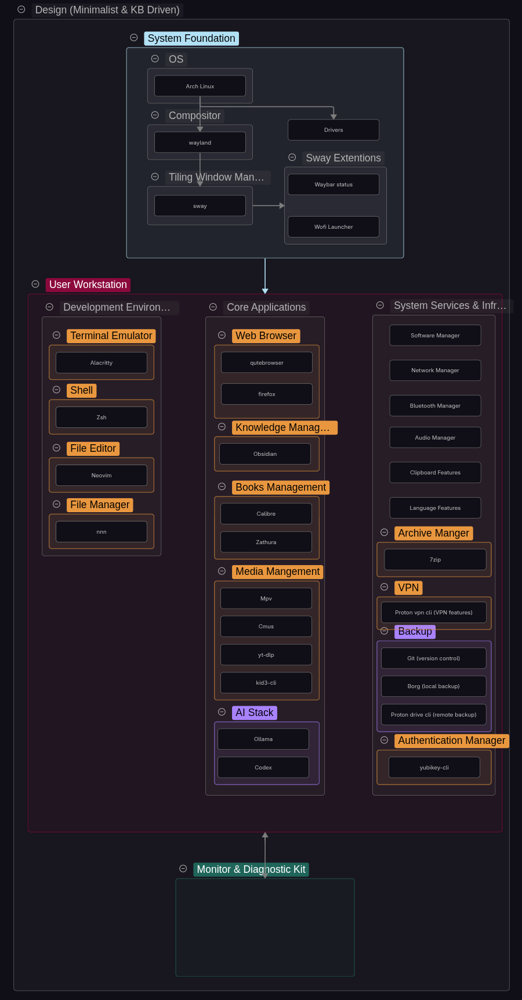

 
# Context :
The first stage of the [Linux Workstation Engineering](/projects/linux-workstation-engineering) project is to establish a design for the workstation I intend to build and use.

The goal is not simply to install Arch Linux and select a collection of applications. The workstation is intended to become a practical environment through which I can develop the ability to configure, operate, troubleshoot, maintain, automate and reproduce a Linux system.

The design therefore needs to account for both the system itself and the way I intend to interact with it.

# Design Objectives:

The workstation should satisfy the following principles:

- **Minimalist**: avoid unnecessary software and functionality.
- **Keyboard-driven**: minimize dependence on mouse-oriented interfaces.
- **Understandable**: important system components should be understandable rather than treated as a black box.

These principles are design constraints rather than requirements that every component must satisfy independently.

# Overview Initial Design:

I divided the workstation into three major areas:

1. **System Foundation**
2. **User Workstation**
3. **Monitoring & Diagnostic Kit**

## System Foundation

The System Foundation contains the components that establish the basic operating and graphical environment.

## User Workstation

The User Workstation contains the applications and services that make the system useful for my actual workflows.

The initial design separates these into areas such as:

- Development environment Represents the interface I use to build, configure and interact with the system.
    
- Core/user applications The software that provides digital functionality I personally need for everyday use.
    
- System services and infrastructure The underlying services and supporting components that provide essential system functionality.
    

These selections are not intended to represent a final software stack. They represent the current workstation design and are expected to change as I use the system and discover better approaches.

## Monitoring & Diagnostic Kit

This area is intentionally incomplete at this stage.

Rather than selecting a large collection of diagnostic utilities in advance, I intend to acquire and learn tools as I encounter actual operational and troubleshooting requirements.

This should prevent the project from becoming a process of collecting software without understanding its purpose.

# Detailed Initial Design:

---

## Operating System

**Decision:** Use Arch Linux as the primary operating system.

**Reasoning:**

I have previous experience using Arch Linux, which makes it a familiar starting point for this project. In addition, Arch’s minimalist approach, which allows the user to install and configure only the software and components they need, is well suited to the design goals of this workstation.

## Compositor & Tiling Window Manager

**Decision:** Use Sway as the primary window manager/compositor.

**Reasoning:**

I have previous experience using i3 and X11 and prefer the tiling window manager approach. For this project, I wanted to move to a Wayland-based compositor while retaining the characteristics I value in i3. Sway was therefore a natural choice due to its similarities with i3, including its keyboard-driven workflow, simplicity, and relatively straightforward configuration. Compared with alternatives such as Hyprland, Sway also provides a more minimal environment fitting for the Linux Workstation Engineering project.

---

## User Workstation Design

**Decision:** Structure the user workstation into three areas: Development Environment, Core Applications, and System Services & Infrastructure.

**Reasoning:**

I separated the workstation into these categories based on the role each component plays rather than treating the software as a single collection.

- **Development Environment**: Contains the tools used to interact with, configure, and develop the system, such as the terminal emulator, shell, editor.
    
- **Core/User Applications**: Contains the software used for my everyday activities and personal workflows, such as browsing, reading, media, and knowledge management.
    
- **System Services & Infrastructure**: Contains the underlying services and supporting components that provide essential functionality for the workstation, such as networking, audio, bluetooth, backups, VPN, and security. These are separated because they support the operation of the system rather than directly serving a user workflow.

This structure provides a simple conceptual model of the workstation while allowing the software stack and categories to evolve as the project develops.

## Terminal Emulator

**Decision:** Use Alacritty.

**Reasoning:**

Alacritty was selected as the terminal emulator because it provides a relatively minimal terminal environment, with no tabs, built-in file manager, or other features attempting to provide functionality that belongs elsewhere in the system. Additionally, it's known to be easy to configure. 

From my personal experience, it's also fast on startup compared to kitty.

## Shell

**Decision:** Use Bash.

**Reasoning:**

After trying both Bash and Zsh, I don't see myself benefiting much from the extra functionality that Zsh provides, such as auto-suggestions or advanced file globbing. It only adds unnecessary layers of complexity, which pushes away from the goal of a minimal Linux workstation design.

Additionally, Bash provides me with the level of customization I need. So for now, I don't see anything that justifies choosing Zsh over Bash.

## File Editor

**Decision:** Use Neovim as the primary text editor.

**Reasoning:**

Neovim fits the keyboard-driven design of the workstation and provides an environment for editing configuration files and scripts without requiring a graphical editor like VSCodium or VSCode. Complemented with nnn, I don't think I need an IDE, as Neovim and nnn will provide what I need while keeping it minimal and keyboard-driven. I have tested this while working on my personal website, and it seems to be working well.

As I'm moving from nano to Neovim, learning and getting used to the different navigation commands will take some time, but eventually I'll get used to them and it should pay off in the end.

## File Manager

**Decision:** Use nnn.

**Reasoning:**

Since nnn is keyboard-driven, I have preferred it over Thunar or even ranger because it is entirely keyboard-driven while also being faster than the other options. Furthermore, after spending a good amount of time using it, I have found its workflow to be fast and easy to use.

## Web Browser

**Decision:** Use qutebrowser as the primary browser, with Firefox retained as a secondary browser.

**Reasoning:**

qutebrowser was the first keyboard-driven browser I was introduced to and have stuck with it since. I have tried the Vimium extension on Chrome, but had issues with indexing the right tab, so when I wanted to switch to another tab, like the fifth one in the row, it wouldn't register my keystroke, along with other issues. So I decided to keep using qutebrowser, as it fits well with the minimalist and keyboard-driven design of the workstation and is suitable for my project requirements.

While qutebrowser is great in terms of usage for my setup, I can't log in with Google on it. Therefore, sometimes I need a backup browser for that purpose.

## Knowledge Manager

**Decision:** Use Obsidian.

**Reasoning:**

The feature that made me move from Notion to Obsidian was Canvas, where I can draw diagrams and link other notes with it. Furthermore, the data lives on the user's drive, providing much more control over personal data. Obsidian is crucial to me, as it is where I store my notes, so it's a fundamental part of reaching a satisfying system design in the Linux Workstation Engineering project. 

These features also align with the project's focus on having control over the tools and data used within the workstation.

## Book Manager

**Decision:** Use Calibre and Zathura for managing and reading books.

**Reasoning:**

Calibre is used as my ebook library manager because it provides a high level of control over metadata, themes, layout and filtering.

I tried Calibre's ebook viewer and, while it is highly customizable, I preferred Zathura. The reason being that the table of contents in Zathura shows the page that corresponds to each chapter, while Calibre doesn't. By default, the ebook viewer's layout and styling in the books also seems a little broken compared to Zathura, so I decided to use Zathura as the document reader.

This is relevant because it satisfies a requirement in my project of meeting my digital needs.

## Media Manager

**Decision:** Use a collection of specialised command-line and lightweight media applications consisting of MPV, CMUS, yt-dlp and kid3-cli.

**Reasoning:**

Media functionality is intentionally divided according to the type of task being performed:

- **MPV** provides video and general media playback.
- **CMUS** provides terminal-based music playback and management.
- **yt-dlp** provides command-line retrieval of media from supported sources.
- **kid3-cli** provides command-line management of audio metadata.

This maintains consistency with the workstation's keyboard-driven and minimalist design.

## AI Stack

**Decision:** Use a combination of Ollama and Codex as the initial AI tooling layer.

**Reasoning:**

**Ollama** provides the local AI environment, allowing models to run directly on the workstation while keeping sensitive or personal data local.

**Codex** provides an AI-assisted development workflow for coding, troubleshooting, documentation, and working with project context.

The AI stack is treated as an engineering aid rather than a dependency or replacement for my own implementation and decision-making. It may assist with understanding, configuring, troubleshooting and automating the workstation, but I remain responsible for the final decisions and implementation.

When using AI, I aim to understand what it did, why it did it, and how I could reproduce the same result myself.

## Backup Stack

**Decision:** Use Git, Borg and Proton Drive CLI as the initial data-protection and recovery stack.

**Reasoning:**

## Backup Strategy

The design follows the **3-2-1 backup principle**: three copies of important data, using two local storage devices, with at least one copy stored off-site:

1. Internal SSD
2. External Drive
3. Proton Drive

**Software Stack**:

- **Git** provides version control and file history.
- **Borg** provides local, deduplicated and encrypted backups.
- **Proton Drive CLI** provides the remote/off-site copy.

These tools serve different recovery purposes and collectively support the 3-2-1 strategy. Git is not considered a replacement for a dedicated backup system.

OS- or drive-level backup is intentionally out of scope for now. The workstation is primarily being used as a testing environment while I become comfortable configuring and using Linux. Once the system reaches a stable state and I intend to keep it longer-term, I will consider adding a solution such as **Timeshift**.

Automation, retention policies and more advanced recovery procedures will be addressed later.

## VPN

**Decision:** Use the Proton VPN CLI.

**Reasoning:**

Since I already have a Proton subscription, I have access to their VPN service. Furthermore, the **Proton VPN CLI** keeps the workflow keyboard-centric, which aligns with the overall design of the Linux workstation.

## Archive Manage

**Decision:** Use 7-Zip.

**Reasoning:**

7-Zip provides a simple way to create and extract compressed archives when needed, without introducing unnecessary functionality.

## Authentication Manager

**Decision:** Use yubikey-cli as the command-line interface for YubiKey-related authentication.

**Reasoning:**

I already own a **YubiKey** and plan to configure it with my accounts. I will also explore the functionality provided by the YubiKey CLI beyond displaying key information and enabling or disabling its features later.

---

## Separate Diagnostic Environment

**Decision:** Treat monitoring and diagnostic tools as their own part of the workstation design.

**Reasoning:**

Diagnostic tools serve a fundamentally different purpose from normal applications. Their purpose is to monitor and troubleshoot the system.

Keeping them separate should make it easier to distinguish between:

- software I use to accomplish tasks
- software I use to understand or diagnose the machine performing those tasks.

---

# Current Assessment

The initial design provides a reasonable starting architecture, but it should not yet be considered mature.

The main areas requiring further development are:

- expansion of the monitoring and diagnostic layer.
- refinement of workstation application categories.
- deeper understanding of the system foundation.
- technical competency in system services & infrastructure.
- evaluation of whether the selected applications actually support the intended workflows.

These will be addressed through implementation and experimentation rather than attempting to design the complete workstation in advance.

# Related Documentation

[Project: Linux Workstation Engineering](/projects/linux-workstation-engineering)
# References
